### DoMath – Summer 2017

# Simulations of Spiral Galaxies

Hubert Bray Benjamin Hamm Yijie Bei Yuanhao Guan Zihui Liu

# Contents

| 1 | Introduction                                                                                                                                                                                                                                                                                                                                                                                                                                                                                     |                                                |  |
|---|--------------------------------------------------------------------------------------------------------------------------------------------------------------------------------------------------------------------------------------------------------------------------------------------------------------------------------------------------------------------------------------------------------------------------------------------------------------------------------------------------|------------------------------------------------|--|
| 2 | Background 2.1 A Brief Introduction to Relevant Physics Concepts 2.1.1 On General Relativity  2.1.2 On Dark Matter and Spiral Galaxies 2.2 The Wave Dark Matter Model  2.3 Simulating Frictions and Collapsing of Spheroidal Proto-Galaxies                                                                                                                                                                                                                  | 3 3 3 3 4 4                     |  |
| 3 | Initialization of Simulations 3.1 An Overview of the Initialization Process  3.2 Initialization of Particle Positions 3.3 Initialization of Particle Speed  3.4 Initialization of Particle Velocity  3.5 Shifting Total Angular Momentum to Align with z-axis  3.6 Expected Values for Physics Measurements  3.6.1 Position and Potential Energy 3.6.2 Kinetic and Total Energy  3.6.3 Angular Momentum along z-axis  | 5 5 5 5 6 7 8 8 9 9 |  |
| 4 | Creating a Generic Potential Function 4.1 An Overview on Generic Potential Functions  4.2 Basic Potentials 4.3 Direct Integration of Green Function 4.4 The Multipole Expansion  4.5 The Spherical Harmonic Expansion                                                                                                                                                                                                                                        | 10 10 10 10 11 12               |  |
| 5 | Orbits of Celestial Bodies in a Given Potential 5.1 An Overview of Orbits in a Given Potential 5.2 Numerical Methods 5.3 Velocity Correction                                                                                                                                                                                                                                                                                                                                   | 13 13 13 16                           |  |
| 6 | Collision 6.1 Coefficient of Restitution and Line of Impact  6.2 Implementation                                                                                                                                                                                                                                                                                                                                                                                                   | 17 17 17                                 |  |
| 7 | Collapse of Spherical Galaxies to Disc Galaxies 7.1 A Brief Introduction to the Process of Collapsing 7.2 Quantifying "Disc-ness" of a Galaxy                                                                                                                                                                                                                                                                                                                                     | 18 18 18                                 |  |
| 8 | Preliminary Simulation Results with Static Potential                                                                                                                                                                                                                                                                                                                                                                                                                                             | 19                                             |  |

| 9                               |                     | The Potential of Dark Matter                                                                | 22 |  |  |
|---------------------------------|---------------------|---------------------------------------------------------------------------------------------|----|--|--|
|                                 | 9.1                 | Solving the Einstein-Klein-Gordon Equation                                                  | 22 |  |  |
|                                 | 9.2                 | Adding more Spherical Harmonic Terms                                                        | 22 |  |  |
| 10 Formation of Spiral Patterns |                     |                                                                                             |    |  |  |
|                                 | 11 References 27 |                                                                                             |    |  |  |
|                                 |                     | List of Figures                                                                             |    |  |  |
|                                 | 1                   | Kent distribution on a 2-sphere: three points sets sampled from the Kent distribution, from |    |  |  |
|                                 |                     | Wikipedia [2017]                                                                         | 7  |  |  |
|                                 | 2                   | Euler's Method, from Wikipedia [2017]                                                       | 14 |  |  |
|                                 | 3                   | Euler's Method Approximation to Orbit                                                    | 14 |  |  |
|                                 | 4                   | Runge-Kutta Fourth Order Method, from Wikipedia [2017]                                   | 15 |  |  |
|                                 | 5                   | Runge-Kutta Method Approximation to Circular Orbit                                       | 15 |  |  |
|                                 | 6                   | Beginning of simulation: cloud                                                           | 19 |  |  |
|                                 | 7                   | Dtabilized: disc                                                                            | 20 |  |  |
|                                 | 8                   | Decreasing total energy                                                                  | 20 |  |  |
|                                 | 9                   | Decreasing rate                                                                             | 21 |  |  |
|                                 | 10                  | lz/lzmax                                                                                 | 21 |  |  |
|                                 | 11                  | Spiral pattern formed when starting with gas cloud                                          | 25 |  |  |
|                                 | 12                  | Cloud at the start                                                                       | 25 |  |  |
|                                 | 13                  | Disc formed                                                                                 | 26 |  |  |

# 1 Introduction

As most of the gravity inside galaxies is not due to visible matter, astronomers have become convinced that galaxies are mostly made out of invisible matter, called dark matter. In this project, we simulated a particular model of galaxy formation to test a theory about dark matter called the wave dark matter model. Several different simulations were conducted in order to test ideas about the nature of dark matter and the role it plays in spiral patterns in galaxies.

# 2 Background

#### 2.1 A Brief Introduction to Relevant Physics Concepts

#### 2.1.1 On General Relativity

Einstein's special theory of relativity, a theory that unified space and time, is really all about the study of the flat Minkowski spacetime, which has a constant pseudo-Riemannian metric [1]. However, in our universe, there is no reason why the spacetime manifold should be flat. This idea gave rise to the general theory of relativity which removed the flat spacetime assumption and proposed that matter curves spacetime. The mass of matter can determine the curvature of spacetime, and geodesics of the metric, which can be calculated using the curvature tensor, can tell us about the orbits of celestial bodies. In this way, the accelerations of celestial bodies can be explained by the curvature of the spacetime manifold instead of by a mysterious "Gravitational Force" as before.

In order to quantify how matter curves spacetime, Einstein proposed the central equation of general relativity:

$$G = 8\pi T \tag{1}$$

where  $G = Ric - \frac{1}{2}Rg$  is the Einstein curvature tensor and T, the stress energy tensor, describes the local energy and momentum density [2]. By applying this theory to astrophysics, problems such as the deviation of Mercury's orbit from Newtonian predictions can thus be resolved. The vacuum Einstein equation, specifically G = 0 is also studied widely due to its simplicity, which predicts black holes, a type of celestial body observed in our universe.

#### 2.1.2 On Dark Matter and Spiral Galaxies

Dark matter is a kind of hypothetical matter that does not interact with electromagnetic force [3]. Since it does not absorb, reflect or emit light, it can only be observed via gravitational effects. According to the standard  $\Lambda CDM$  model of cosmology, the total mass of the universe is comprised of 4.9% ordinary baryonic matter, 26.8% dark matter and 68.3% dark energy [4]. Although dark energy makes up over sixt percent of the total mass of our universe, since it is distributed evenly everywhere with a small density profile, its mass is negligible in the scale of galaxies wherein dark matter dominates the mass. Take the milky-way galaxy as an example, the visible matter makes up about  $9 \times 10^{10}~M_{\odot}$  while dark matter is likely makes up about  $1.2^{+1.8}_{-1.5} \times 10^{12}~M_{\odot}$ , rendering an approximate 13.3 dark matter to baryonic matter ratio [5].

In the scale of galaxies, dark matter forms triaxial ellipsoidal shaped dark matter halo, whose density profiles are not universal [6][7]. One theory to predict such pattern is steamed from quantum field theory: the weakly interacting massive particles(WIMPs) model that treat dark matter as actual particles, but the theory we are interested in is the wave dark matter steamed from general relativity.

Spiral galaxies are disc galaxies with spiral patterns that contain stars, gas and dusts. These galaxies usually have bright spiral arms that extend from the center into the galactic disc. There are many theories how these spiral patterns are formed such as caused by supernova shock waves [9], but in this paper we are interested in the idea that the dynamics of dark matter give rise to such spirals patterns [2]. In Bray's 2010 paper, "On Dark Matter, Spiral Galaxies, and the Axioms of General Relativity", simulations have already shown that the spiral patterns are compatible with the Wave Dark Matter model and might even be caused by the dynamics of wave dark matter. Since the previous simulation was initialized so that the stars, gas and dusts are approximately in a disk, it assumed the galaxy to be a disk galaxy at the very beginning. In this paper, however, we are interested in a longer time scale and providing a unified theory of both the spiral patterns and the disc-like shape found in spiral galaxies.

From a top-down point of view, it is usually believed that galaxies form from roughly spherically distributed gas and dust clouds under the influence of gravity which pulls the particles together to the center. If the system has an initial overall angular momentum and has plenty of gas and dusts, the friction of gas and dusts would lower the temperature of the system. As a result, the system that is originally spheroidal has to collapse into a disc-like shape to preserve angular momentum at a lower energy level.

In this simulation, we initialized the gas and dust clouds to be roughly spherical and centered at the origin, and we initialized the system to have an initial overall angular momentum Lz along z axis. Then, we imposed a potential calculated using the Einstein-Klein-Gordon Equation to the system and started our simulation. The frictions of gas and dusts particles kept lowering the energy of the system, pressuring the system to collapse while the dynamics of dark matter kept "stirring" the visible matters and adding energy to the system. We run the simulation until the whole system is stable, determined by Virial Theorem.

# 2.2 The Wave Dark Matter Model

When using the Einstein equation to calculate the connection of the spacetime metric, if we assume the manifold to be both hausdorff and torsionless, we get the classical Levi-Civita connection. One concern about this connection is that when studying gravitational effects, dark matter needed to be added in manually as the shape of triaxial ellipsoidal halos since the connection itself cannot predict the existence of dark matter. If we reconsider the assumptions of such connection, however, and allow the spacetime metric to have torsion, we are able to get new metrics whose torsion can hopefully explain the "extra" gravity caused by dark matter: just as the curvature of the metric can produce accelerations, the torsion can as well.

If we allow the spacetime manifold to have torsion, the first and more natural action we can try is of quadratic form:

Let {∂i}, 0 ≤ i ≤ 3, be the tangent vector fields to N corresponding to standard basis vector fields of the coordinate chart. Let gij = g(∂i, ∂j) and Γijk = g(∇∂i∂j, ∂k), and let

$$M = \{g_{ij}\} \quad and \quad C = \{\Gamma_{ijk}\} \quad and \quad M' = \{g_{ij,k}\} \quad and \quad C' = \{\Gamma_{ijk,l}\}$$
 (2)

For all coordinate charts Φ : Ω ⊂ N → R4 and open sets U whose closure is compact and in the interior of Ω,(g, ∇) is a critical point of the functional

$$F_{\Phi,U}(g,\nabla) = \int_{\Phi(U)} Quad_M(M' \bigcup M \bigcup C' \bigcup C) dV_{R^4}$$
(3)

with respect to smooth variations of the metric and connection compactly supported in U, for some fixed quadratic functional QuadM with coefficients in M.

If we solve this equation, the Euler-Lagrange equation would give us a modified Einstein equation coupled with a Klein-Gordon equation:

$$G + \Lambda g = 8\pi \mu_0 \left\{ 2 \frac{df \otimes df}{\Upsilon^2} - \left( \frac{|df|^2}{\Upsilon^2} + f^2 \right) g \right\}$$
 (4)

$$\Box f = \Upsilon^2 f \tag{5}$$

By solving the Klein-Gordon equation, we can solve the wave function f of dark matter and plug it into equation (4) to solve for the density function µDM. Since in the scale of galaxies, the effect of general relativity on gravitational potential is small, we can solve for the potential by using the Newtonian equation:

$$\Delta_x V = 4\pi \mu_{DM} \tag{6}$$

Since the gradient of the potential function gives the acceleration at a given point, the orbits of particles can be calculated and the dynamic of the galaxy can be determined.

### 2.3 Simulating Frictions and Collapsing of Spheroidal Proto-Galaxies

### 3 Initialization of Simulations

#### 3.1 An Overview of the Initialization Process

In order to simplify mechanical energy lost in the system, we are using a particle to particle model instead of a fluid model to model the frictions. In this approach, we ignore the internal dynamics of clouds so each gas and dust cloud is treated as a rigid spherical body, and for this reason, we call them "particles" in this paper. In order to simplify our simulations, each particle is set to have the same mass, m and the same radius. The initialization of simulations are realized via three steps. In the first step, the positions of the clouds are determined using a combined normal distribution along three Cartesian coordinates. In this way, the distribution of the distance (r) from each particle (i) to the center would conform a chi distribution that is spherically symmetric. In the second step, the potential energy of each particle i is calculated using  $r_i$  and the kinetic energy of each particle is determined via the Maxwell-Boltzmann distribution, from which we can calculate the speed of each particle. In the third step, for each particle, we use a Kent distribution to determine the direction of its velocity such that the expected direction of its angular momentum with respect to the center is along the z direction in Cartesian coordinates. In the end, we calculate the actual value for the total angular momentum of all the particles, and rotate the the whole system such that the total angular momentum is along the z axis.

#### 3.2 Initialization of Particle Positions

The positions of the particles are initialized using three standard Gaussian distributions in three Cartesian directions (namely, x, y and z). A general density function for the Gaussian distribution can be given by

$$f = \frac{1}{\sqrt{2\pi\sigma^2}} e^{-\frac{(x-\mu)}{2\sigma^2}} \tag{7}$$

where f is the density function,  $\mu$  the mean and  $\sigma$  the standard deviation of the distribution. In our initialization, the mean of each distribution along each axis is set to be zero so that the particles are centered at the origin. The standard deviation of the resulting chi distribution is determined by the scale of the galaxy set by ourselves, given by the following formula:

$$\sigma_{tot} = \sqrt{3\sigma^2} \tag{8}$$

where  $\sigma_{tot}$  is the standard deviation of the combined distribution. Since the overall distribution of the square of distance from a particle (i) to the center  $(r^2)$  is a Chi-squared distribution with two degrees of freedom (addition of three normal distributions), we can set  $\sigma_{tot}$  according to the radius of a given galaxy. For example, if the radius of a galaxy we are simulating is  $r_g$ , since for a chi-squared distribution with two degrees of freedom three standard deviations includes about 80% of the particles, we can just set  $r_g = 3\sigma_{tot}$ . From equation (8), we can get  $r_g = 3\sqrt{3}\sigma$ , and thus we can set  $\sigma = \frac{1}{3\sqrt{3}}$  to get the appropriate galactic radius.

#### 3.3 Initialization of Particle Speed

The initial speeds of the particles are relevant to their initial energy level and thus should obey a distribution related to the temperature of the whole galactic system (T). Since we are considering gas and dust clouds in motion, we will use the MaxwellBoltzmann distribution to initialize the speed of particles. Since MaxwellBoltzmann distribution has a density function of the form:

$$f(|v|) = \sqrt{\left(\frac{m}{2\pi kT}\right)^3 4\pi |v|^2 e^{-\frac{m|v|^2}{2kT}}}$$
(9)

where m is the particle mass and kT is the product of Boltzmann's constant and thermodynamic temperature. Thus, by specifying an initial temperature for the whole system, we are able to choose the speed for each particle randomly from the Maxwell-Boltzmann distribution. After the speed for a given particle (i) is determined, its total energy can be calculated as the summation of potential and kinetic energy:

$$E_{i,tot} = E_{i,kinetic} + E_{i,potential} = \frac{1}{2}m|v_i|^2 + V(i)$$
(10)

In this equation, the potential energy of particle i depends on our choice of gravitational potential, which would generally be a non-positive function that approaches zero at infinity.

Since we are interested in the evolution of galactic systems, we are only interested in particles that remains in the system. Because a particle would escape from the system if it has positive total energy we would discard those particles that can reach infinity. As a result, after the speed of a particle (|vi |) is chosen from the distribution, if Ei,tot is greater or equal to zero, we would discard the chosen speed and use Maxwell-Boltzmann distribution to randomly choose another speed for the particle. Although we can ensure that no particle can reach infinity in our initialization process, particles can still exchange energy during collisions and may still escape from the system.

# 3.4 Initialization of Particle Velocity

After the speed for each particle is chosen, the total energy of the whole system would be determined. Since total energy is conserved except during collisions, the initial status would possess the maximum amount of energy throughout simulations. As total energy decreases, since the system need to preserve angular momentum, it has to collapse from a spheroidal shape into a disk. In order to simulate the process of disk formation, we give the system an initial angular momentum.

When each particle moves along its orbit, the cross product of its position and its momentum would give rise to an angular momentum relative to the origin: ~ri × m~vi . If we assume the force produced by a given gravitational potential V is −∇V and is the potential is spherically symmetric, then the total angular momentum would be preserved. If the particles are moving randomly during initialization, each particle would produce an angular momentum of different direction, and the sum of which may still be negligible considering the scale of the system. In order to let the system have a controlled initial angular momentum, we decided to align angular momentum along the z direction. If the position and speed of this particle is fixed, we can choose a direction for its velocity that maximize the z-direction angular momentum. Since only motion in the xy plane can result in an angular momentum along z-axis, we can increase Li,z by allowing the xy plane component of vi that contributes to a positive z-direction angular momentum to be larger.

Since for a specific particle i, if its position ri and its speed |vi | have already been determined, the only why to change its z-direction angular momentum is to change the direction of its velocity. If we choose the location of this particle as the origin, and the speed of this particle as radius, we would be able to construct a "velocity" sphere on which every vector denotes a possible velocity for this particle. Let the xy plane component of the position vector ri to be ri,xy, in order to maximize Li,z, we need to maximize the cross product of ri,xy and vi . Let ri be expressed in the Cartesian coordinates as (x, y, z), then the direction that maximize Li,z would be √ (−y,x,0) x2+y2 .

Although we can set every particle to have a velocity in the direction √ (−y,x,0) x2+y2 , there would be much less collisions, and thus much less energy lost if all particles are initialized with velocities on the same plane. In order to simulate reality and to see have proto-galaxies actually evolves, we decided to initialize the velocities such that there is still randomization.

In our simulations, this problem is solved by using the "Kent Distribution", which is a special case of the "Von MisesFisher distribution" to determine the velocity for each particle. As shown in Figure 1 below, "Kent Distribution" is a distribution on a 2-sphere centered at a given direction as "a normal distribution wrapped on a sphere". If we consider our "velocity sphere" to be the 2-sphere of interest, and √ (−y,x,0) x2+y2 the mean direction of Kent distribution, we would be able to randomly select the direction for vi while with a total z-direction angular momentum guaranteed.

A general form of the density function of a Kent distribution can be written as:

$$f(x) = \frac{1}{c(\kappa, \beta)} exp\{\kappa \gamma_1 \cdot x + \beta [(\gamma_2 \cdot x)^2 - (\gamma_3 \cdot x)^2]\}$$
(11)

where x is a point on the two sphere, which is also a vector starting from the origin; κ, the spread of the distribution; β, a measurement that determines the ellipticity of the contours of equal probability that can go from zero to  $\frac{1}{2}\kappa$ ;  $\gamma_1$  the mean of the distribution;  $\gamma_2$  and  $\gamma_3$  the major and minor axes; and  $c(\kappa, \beta)$  the normalizing constant that can be determined by the following formula:

$$c(\kappa,\beta) = 2\pi \sum_{j=0}^{\infty} \frac{\Gamma(j+\frac{1}{2})}{\Gamma(j+1)} \beta^{2j} (\frac{1}{2}\kappa)^{-2j-\frac{1}{2}} I_{2j+\frac{1}{2}}(\kappa)$$
(12)

where  $I_v(\kappa)$  is the modified Bessel function and  $\Gamma(j)$  the gamma function.

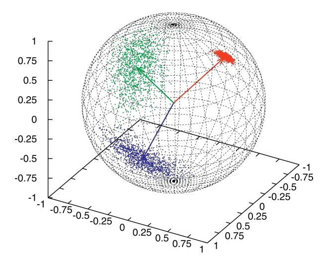

Figure 1: Kent distribution on a 2-sphere: three points sets sampled from the Kent distribution, from Wikipedia [2017]

In our simulations, since we are not interested in producing a total angular momentum along any axis other than z - axis, there is no reason why we should let the contour of Kent distribution to be elliptical. By constraining the distribution to be like a circle, the density function can be simplified as:

$$f(x) = \frac{1}{c(\kappa)} exp\{\kappa \gamma_1 \cdot x\}$$
 (13)

In our simulations, for each particle i, we set  $\gamma_1$  to be  $\frac{(-y,x,0)}{\sqrt{x^2+y^2}}$ , and as we change  $\kappa$ , we can control the overall z-direction angular momentum to a reasonable level.

#### 3.5 Shifting Total Angular Momentum to Align with z-axis

After the velocity of each particle is determined from the Kent distribution, although the expected value for the total z-direction angular momentum is a predetermined value, the actual overall angular momentum may vary a little from the expected value due to randomization. Thus, in order to better simulate the whole system, we rotated the whole system such that its total angular momentum is along z-axis.

The overall angular momentum of the system is first calculated by the formula:

$$L_{tot} = \Sigma(r_i \times m_i v_i) \tag{14}$$

Assume the total angular momentum is along the direction (a, b, c), then in order to rotate the system so that (a, b, c) align with z-axis, which is (0, 0, 1), we need to apply the rotation matrix twice. First, we apply the rotation matrix along x-axis. The angel between the yz plane component of (a, b, c) and z-axis can be solved with the follow equation:

$$\cos(\theta) = \frac{(0, b, c) \cdot (0, 0, c)}{|(0, b, c)| \cdot |(0, 0, c)|} = \frac{c}{\sqrt{b^2 + c^2}}$$
(15)

Thus, if  $b \ge 0$ , we can operate with the rotation matrix,

$$\begin{bmatrix} 1 & 0 & 0 \\ 0 & \cos(\theta) & -\sin(\theta) \\ 0 & \sin(\theta) & \cos(\theta) \end{bmatrix}$$

Otherwise, the following matrix would be applied to every point in the system,

$$\begin{bmatrix} 1 & 0 & 0 \\ 0 & \cos(\theta) & \sin(\theta) \\ 0 & -\sin(\theta) & \cos(\theta) \end{bmatrix}$$

After the x-direction rotation, a y-direction rotation would also be applied similarly. If a > 0, we would apply the following matrix to every point in the system,

$$\begin{bmatrix} \cos(\theta) & 0 & \sin(\theta) \\ 0 & 1 & 0 \\ -\sin(\theta) & 0 & \cos(\theta) \end{bmatrix}$$

Otherwise, the following rotational matrix would be applied,

$$\begin{bmatrix} \cos(\theta) & 0 & -\sin(\theta) \\ 0 & 1 & 0 \\ \sin(\theta) & 0 & \cos(\theta) \end{bmatrix}$$

By applying these matrices to the system, the system would be rotated such that the total angular momentum is along the z-direction. Since z-direction angular momentum does not change either during orbit motions and during collisions, it would remain a fixed constant throughout the whole simulation.

# 3.6 Expected Values for Physics Measurements

Since we have already initialized the system, it is very important to understand the expected value for several physics measurement so that we can set the scale of our simulations correctly. In this way, when simulating a specific galaxy, we can compare the expected values of physics measurements in our simulation to the observed values.

#### 3.6.1 Position and Potential Energy

For the position of each particle, since the distribution is normal along each axis, the combined distribution (distance to the center) would conform a chi distribution. Since the initialization for positions is spherically symmetric, the expected value for distance to the center (|r|) would be same along each line crossing the origin.

Lemma 3.6.1: The expected value for distance to the center (|r|) would be same along each line crossing the origin.

Demonstration: Since the distributions are the same along x, y, and z axes, The expected value along these three axes should be the same due to symmetry. Take the expected value for |x| (< |x| >) as an example. < |x| > can be calculated by integrating with the density function along x direction,

$$\langle |x| \rangle = \int_{-\infty}^{\infty} \frac{1}{\sqrt{2\pi\sigma^2}} \cdot |x| \cdot e^{-\frac{x^2}{2\sigma^2}} dx = \frac{\sqrt{2} \cdot \sigma}{\sqrt{\pi}}$$
 (16)

while < |r| > can be calculated by a triple integral along all three axes,

$$<|r|> = \int_0^{2\pi} \int_0^{\pi} \int_0^{\infty} r^2 \sin(\phi) \cdot (2\pi\sigma^2)^{-\frac{3}{2}} e^{-\frac{r^2}{2\sigma^2}} dr d\phi d\theta = \frac{\sqrt{2} \cdot \sigma}{\sqrt{\pi}} = <|x|>$$
 (17)

thus, the expected value for distance is the same along each line crossing the origin.

For a more generic power potential, the expected value for r n can also be calculated by a triple integral,

$$\langle |r^{n}| \rangle = \int_{0}^{2\pi} \int_{0}^{\pi} \int_{0}^{\infty} r^{(n+2)} \sin(\phi) \cdot (2\pi\sigma^{2})^{-\frac{3}{2}} e^{-\frac{r^{2}}{2\sigma^{2}}} dr d\phi d\theta$$

$$= 4\pi \cdot (2\pi\sigma^{2})^{-\frac{3}{2}} \cdot 2^{\frac{n+1}{2}} \cdot (\frac{1}{\sigma^{2}})^{\frac{1}{2}(-n-3)} \cdot \Gamma(\frac{n+3}{2})$$

For the classical case where  $n=-1, <|\frac{1}{r}|>=4\pi\cdot(2\pi\sigma^2)^{-\frac{3}{2}}\cdot\sigma^2=\frac{\sqrt{2}}{\sqrt{\pi\sigma^2}}$ . Since a generic power potential has the form of  $c\cdot|r^n|$ , where c is a constant determined by our choice of potential, and every particle has the same mass m, the expected value for total potential energy would be  $< E_p >= c\cdot m \cdot 4\pi\cdot(2\pi\sigma^2)^{-\frac{3}{2}}\cdot 2^{\frac{n+1}{2}}\cdot(\frac{1}{\sigma^2})^{\frac{1}{2}(-n-3)}\cdot\Gamma(\frac{n+3}{2})$ 

#### 3.6.2 Kinetic and Total Energy

The expected value for total kinetic energy can be calculated using the Maxwell-Boltzmann distribution. Since  $f(|v|) = \sqrt{(\frac{m}{2\pi kT})^3} 4\pi |v|^2 e^{-\frac{m|v|^2}{2kT}}$ ,

$$\langle E_k \rangle = \frac{1}{2}m \cdot \langle v^2 \rangle$$
$$= \frac{1}{2}m \cdot \int_0^\infty v^2 f(|v|) dv$$
$$= \frac{3}{2}KT$$

where K is the Boltzmann constant and T the thermodynamic temperature of the system. Thus, the total energy can be calculated as  $E_k + E_p = \frac{3}{2}KT + c \cdot m \cdot 4\pi \cdot (2\pi\sigma^2)^{-\frac{3}{2}} \cdot 2^{\frac{n+1}{2}} \cdot (\frac{1}{\sigma^2})^{\frac{1}{2}(-n-3)} \cdot \Gamma(\frac{n+3}{2})$ . We can see that in this formula, c and n depend on our choice of gravitational potential, T depends on our choice of the initial thermodynamic temperature and  $\sigma$  depends on the scale of galaxy. By changing those parameters, we are able to control the total expected initial energy of the whole system.

#### 3.6.3 Angular Momentum along z-axis

The expected value for total angular momentum can be calculated using the Kent distribution. For a particle i, consider the following coordinate patch for its velocity sphere:  $P = (|v|\sin(\phi)\cos(\theta), |v|\sin(\phi)\sin(\theta), |v|\cos(\phi))$ . The area form for this patch relative to  $\phi$  and  $\theta$  is  $|\frac{\partial P}{\partial \theta} \times \frac{\partial P}{\partial \phi}| = v^2 \sin(\phi)$ . Thus, the expected value for the velocity of this particle  $(v_i)$  is

$$\begin{split} < v_i > &= \int P \cdot f(P) dA \\ &= \int_0^{2\pi} \int_0^{\pi} P \cdot f(P) \cdot (|\frac{\partial P}{\partial \theta} \times \frac{\partial P}{\partial \phi}|) d\phi d\theta \\ &= \int_0^{2\pi} \int_0^{\pi} (|v_i| \sin(\phi) \cos(\theta), |v_i| \sin(\phi) \sin(\theta), |v_i| \cos(\phi)) \cdot \frac{1}{c(\kappa)} exp\{\kappa \gamma_1 \cdot P\} \cdot v^2 \sin(\phi) d\phi d\theta \end{split}$$

Note that since  $\gamma_1$  is the mean direction for all the velocity vectors, the expected value for  $v_i$  is actually  $\frac{1}{c(k)} \cdot \gamma_1$  where  $\gamma_1$  is  $\frac{(-y,x,0)}{\sqrt{x^2+y^2}}$  and  $c(\kappa) = 4\pi \cdot \frac{1}{\kappa} \cdot \sinh(\kappa)$ . The total expected angular momentum would then be  $\Sigma(r_i \times m < v_i >)$ . Since  $r_i$  is chosen from three normal distributions, this summation is hard to calculate analytically. Thus, in our simulations, the total angular momentum would be calculated computationally right after initialization.

# 4 Creating a Generic Potential Function

#### 4.1 An Overview on Generic Potential Functions

In Bray's 2010 paper, given the initial condition that all matters lie on the same plane, with a potential function given by the Einstein-Klein-Gordon Equation, spiral patterns were observed in the galaxy simulations. Although those simulations were attempts to confirm the Wave Dark Matter theory and have moved us closer to the nature of galaxy formation, it still remains unknown whether it is this specific potential for wave dark matter that can produce spiral patterns or all generic potentials can somewhat create spiral patterns. By constructing different gravitational potentials and trying them on our simulations, we will be able to better answer this question. In addition, since not all potentials can give rise to the disc-shape of spiral galaxies, we are also trying to eliminate some of the potentials that behave dramatically different from our universe from our theory using our simulations.

#### 4.2 Basic Potentials

The most commonly seen gravitational potentials are power potential. They are of the form  $V(r) = c \cdot r^n$ .

#### 4.3 Direct Integration of Green Function

Since Green functions are solutions to Poisson Equation, if we know the distribution of matter in a space, we would be able to calculate the gravitational potential that it produces by integrating the Green function along the boundaries,

$$V = \int -\frac{G\rho}{r}dv \tag{18}$$

Since according to observations, Dark Matter is roughly a tri-axial spheroid, we would calculate the gravitational potential produced by an rotating ellipsoid as an example of this approach.

If we parametrize the ellipsoid as  $\frac{x^2}{a^2} + \frac{y^2}{b^2} + \frac{z^2}{c^2} = 1$ , the volume for this ellipsoid would be,

$$v = \int_{-a}^{a} \int_{-b \cdot \sqrt{1 - \frac{x^2}{a^2}}}^{b \cdot \sqrt{1 - \frac{x^2}{a^2}}} \int_{-c\sqrt{1 - \frac{x^2}{a^2} - \frac{y^2}{b^2}}}^{c\sqrt{1 - \frac{x^2}{a^2} - \frac{y^2}{b^2}}} dz dy dx$$
(19)

Since Dark Matter is also rotating in the xy plane, we can change the boundary to calculate the gravitational potential,

$$V((x',y',z')) = \int_{-c}^{c} \int_{-b\sqrt{1-\frac{z^2}{c^2}}}^{b\sqrt{1-\frac{z^2}{c^2}}} \int_{-a\sqrt{1-\frac{y^2}{b^2}-\frac{z^2}{c^2}}}^{a\sqrt{1-\frac{y^2}{b^2}-\frac{z^2}{c^2}}} \frac{G\rho}{\sqrt{xx'+yy'+zz'}} dxdydz$$
 (20)

where (x', y', z') is a point of reference outside the ellipsoid.

If the ellipsoidal gravitational potential is time dependent and rotates along the z-axis with a constant angular velocity  $\omega$ , let the angular placement be  $\alpha = \omega \cdot t$ , the potential at time t would be able to calculate if we rotate the original potential with  $\alpha$  along z-axis. In order to get the rotated potential, we can just apply the rotation matrix to the original boundary of our integral. In xy plane, z = 0,

$$\frac{(x\cos(\alpha) + y\sin(\alpha))^2}{a^2} + \frac{(x\sin(\alpha) - y\cos(\alpha))^2}{b^2} = 1$$
(21)

Since the boundaries are the limits for x and y, it can be given by solving  $\frac{dy}{dx} = 0$ ,

$$\frac{dy}{dx} = -\frac{a^2x\sin^2(\alpha) + y(a-b)(a+b)\sin(\alpha)\cos(\alpha) + b^2x\cos^2(\alpha)}{a^2y\cos^2(\alpha) + x(a-b)(a+b)\sin(\alpha)\cos(\alpha) + b^2y\sin^2(\alpha)}$$
(22)

By solving this equation, we would be able to get  $x \in [-\sqrt{a^2 \cos^2(\alpha) + b^2 \sin^2(\alpha)}, \sqrt{a^2 \cos^2(\alpha) + b^2 \sin^2(\alpha)}]$  and  $y \in [-\sqrt{a^2 \sin^2(\alpha) + b^2 \cos^2(\alpha)}, \sqrt{a^2 \sin^2(\alpha) + b^2 \cos^2(\alpha)}]$ 

If we change the boundaries to the rotated boundaries for the ellipsoid, we would be able to calculate and update the potential to our simulator at each time step. This integral has been solved in Som and Chakravarty's 2012 paper [10], but since the result is complicated and hard to apply to simulators, we would use a computational method to do this integral.

#### 4.4 The Multipole Expansion

One approach to create a generic potential lies on the fact that all potential can be expanded to a series of "pole potentials". This method is similar to directly integrating the green function, but since green function is hard to integrate on irregular boundaries, it would be easier to approximate the result using multipole expansion. In this expansion, for a spherically symmetric potential, there would only be monopole term contributing to the overall gravitational potential. However, if the potential is not spherically symmetric to the origin, there would be other terms as well, such as the dipole and quadropole.

The basic idea for the "multi-pole" expansion is the Laplace expansion of the Green function,

$$\frac{1}{|r-r'|} = \sum_{l=0}^{\infty} \frac{4\pi}{2l+1} \sum_{m=-l}^{l} (-1)^m \frac{r_{<}^l}{r_{>}^{l+1}} Y_l^{-m}(\theta, \phi) Y_l^m(\theta', \phi')$$
(23)

where  $r_{<}$  is the smaller one of r and r', and  $r_{>}$  the larger one. For the sake of simplicity, if we only consider the first two terms of the expansion, then,

$$V = -\frac{G}{r} \left[ \int \rho(r') d^3 r' + \frac{1}{r} \int r' \cos(\gamma) \rho(r') d^3 r' + \frac{1}{r^2} \int r'^2 P_2(\cos(\gamma)) \rho(r') d^3 r' \right]$$
 (24)

where  $\int \rho(r')d^3r'$  is the monopole term,  $\frac{1}{r}\int r'\cos(\gamma)\rho(r')d^3r'$  the dipole term and  $\frac{1}{r^2}\int r'^2P_2(\cos(\gamma))\rho(r')d^3r'$  the quadropole term. Thus, if we consider a second order quadropole expansion, any generic potential can be expanded as,

$$V = -G \cdot \left(\frac{M}{r} + \frac{\vec{P} \cdot \hat{r}}{r^2} + \frac{1}{2r^3} \Sigma(Q_{ij}\hat{r}_i\hat{r}_j)\right)$$
 (25)

where  $Q_{ij} = \int (3\vec{r_i'}\vec{r_j'} - r'^2\delta_{ij})\rho(\vec{r_j'})d^3\vec{r_j'}$ , and  $P_{\alpha} = \sum_{i=1}^{N} (q_i r_{i\alpha})$ .

Take two point mass on the z direction as an example, assume they both have mass 1 and located at (o, o, 1) and (0, 0, -1), then the density function would be given by this combination of two Dirac-Delta functions. The matrix Q would be calculated as,

$$\begin{bmatrix} -2 & 0 & 0 \\ 0 & -2 & 0 \\ 0 & 0 & 4 \end{bmatrix}$$

and since we notice P=0, there would be no dipole in this case.

Now, if we let two point masses to rotate in the xy plane with constant angular velocity. The position of the two point masses would be  $(\cos(\omega t), \sin(\omega t, 0))$  and  $(-\cos(\omega t), -\sin(\omega t), 0)$ . With the same method, we can calculate that the matrix of Q, it would be

$$\begin{bmatrix} 2(2\cos^2(\omega t) - \sin^2(\omega t)) & 6\sin(\omega t)\cos(\omega t) & 0\\ 6\sin(\omega t)\cos(\omega t) & 2(2\sin^2(\omega t) - \cos^2(\omega t)) & 0\\ 0 & 0 & -2 \end{bmatrix}$$

The multipole expansion is a very useful alternative for directly integrating the Green function. Since the contribution of the  $n^{th}$  degree expansion to the total gravitational potential is inversely proportional to radius, when n is large, the contribution is really small except for a small region near the center. But since we assume the center to have a radius that no other particle can reach, it does not matter how the potential behave inside that radius any more. One drawback of the multipole expansion is that it might result in negative mass during the approximation, which does not exist in out universe.

### 4.5 The Spherical Harmonic Expansion

The most powerful tool to solve the potential of the shape of roughly a sphere is spherical harmonics. Since the general solution to the Poisson equation,

$$\nabla^2 V = -4\pi \rho(\vec{r'}) \tag{26}$$

is of the form r nωn(r)Y m l (θ, φ), all potentials can be expanded by using the spherical harmonics as,

$$V(r,\theta,\phi) = \sum r^n \omega_n(r) Y_l^m(\theta,\phi)$$
(27)

As spherical harmonics have very nice properties that

$$\nabla^2 Y_l^m = \frac{l(l+1)}{r^2} Y_l^m \tag{28}$$

it would be easier for us to calculate both analytically and computationally using our simulator for the potential of our wave dark matter model. The details of using spherical harmonic expansion to solve the potentials for dark matter can be seen in the latter secitons.

# 5 Orbits of Celestial Bodies in a Given Potential

### 5.1 An Overview of Orbits in a Given Potential

In general relativity, the orbits for celestial bodies are geodesics of the space-time manifold that can be calculated using the curvature of this Minkowski Space. In the scale of galaxies, which is the scale we are interested in throughout this paper, Newtonian physics approximates motions of celestial bodies reasonably well. Thus, with loss of generality, we will use Newtonian physics to calculate the orbits of gas and dusts cloud in the proto-galaxies, which normally moves slowly compared to the speed of light.

The simulation requires an adequately precise approximation to the evolution of particles' positions and velocities in a possibly very random and general scalar gravitational potential field. With the idea that a particle's trajectory in such a scalar potential field is generally not to be solved analytically, a numerical approximation approach is preferred. The position and velocity of each particle at each time step will be approximated sequentially. The key theory involved in the simulation lies upon solving a second order ordinary differential equation for each particle in the following form:

$$\ddot{x} = f(\dot{x}, x, t) \tag{29}$$

where x is a three-dimensional vector parameterized by the variable t denoting time. The function f is determined by the gravitational potential field in question. For a scalar potential field whose magnitude at each location is only a function of the spatial location itself, the following relation holds:

$$F = -\frac{dU}{dx} \tag{30}$$

where F is the force that a particle experiences at the different locations in the field. If the mass of the particle is taken to be unity, then combining the above two equations gives rise to:

$$\ddot{x} = f(\dot{x}, x, t) = -\frac{dU}{dx} \tag{31}$$

therefore relating the acceleration of a particle with a given potential function.

In this paper, the scalar potential function is more general and changes with time. However, with the assumption that the evolving potential can be taken as still at every single time step (snapshots of the potential), the above mathematical relation will continue to hold true.

Further more, the above second order differential equation can be broken down into two first order differential equations to which numerical methods can be applied. Explicitly, they have the following form:

$$\dot{x} = g(x, t) \tag{32}$$

$$\ddot{x} = f(\dot{x}, x, t) \tag{33}$$

The approximation of ¨x at each time step will be used to approximate ˙x in the subsequent step, which in turn approximates x.

### 5.2 Numerical Methods

Among the many numerical methods to solving differential equations, Euler's method is the most straightforward and computationally inexpensive. Given the equation governing the gradient of a function, Euler's method sequentially calculates the value of the function, generating a series of values with the following formula:

$$f(x_{n+1}) = f(x_n) + f'(x_n)\dot{d}x$$
(34)

This method biases towards the starting end of the approximation and its approximations tend to gradually diverge from the true values. Above simulation of the circular orbit confirms the gradual accumulation of error in the computation process that eventually led to the particle in simulation to fly off its orbit.

A more accurate numerical method, the Runge-Kutta fourth order method was implemented instead. The Runge-Kutta fourth order method takes a weighted average of the gradient between two consecutive steps to estimate a balanced gradient that better approximates the end point. In each time step, the following

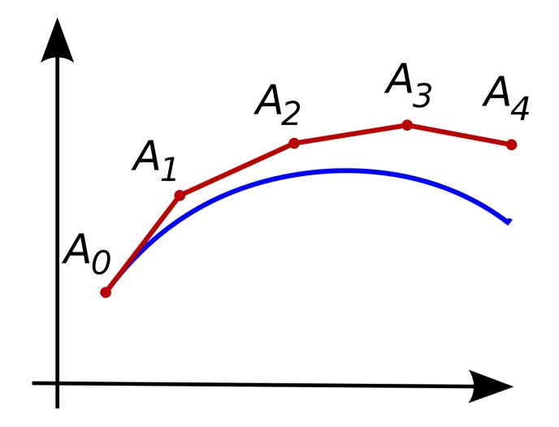

Figure 2: Euler's Method, from Wikipedia [2017]

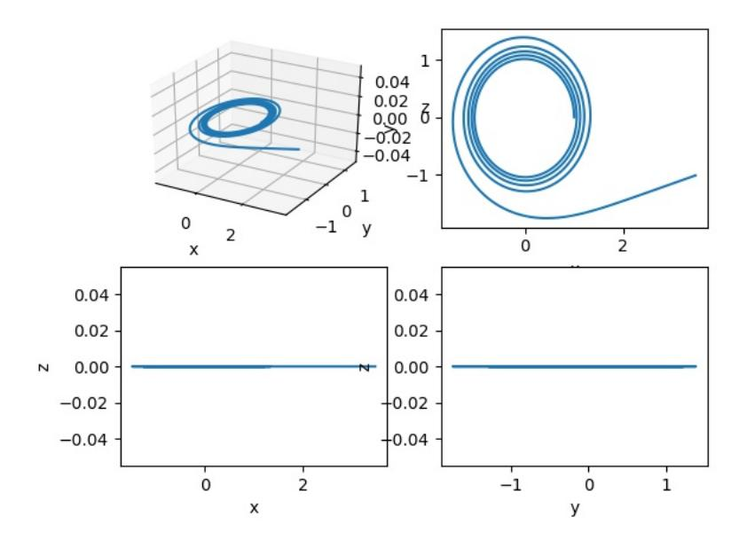

Figure 3: Euler's Method Approximation to Orbit

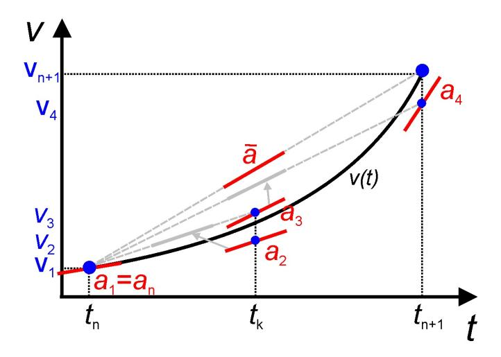

Figure 4: Runge-Kutta Fourth Order Method, from Wikipedia [2017]

four estimated slopes are calculated:

$$k_1 = f(y(t_0), t_0) (35)$$

$$k_2 = f(y(t_0) + k_1 \frac{h}{2}, t_0 + \frac{h}{2})$$
(36)

$$k_3 = f(y(t_0) + k_2 \frac{h}{2}, t_0 + \frac{h}{2})$$
 (37)

$$k_4 = f(y(t_0) + k_3 h, t_0 + h) (38)$$

And their weighted average is taken to estimate the end point:

$$y(t_0 + h) = y(t_0) + \left(\frac{k_1}{6} + \frac{k_2}{3} + \frac{k_3}{3} + \frac{k_4}{6}\right)h \tag{39}$$

With this method, the accuracy of the orbital calculation is greatly improved. The result indicates that

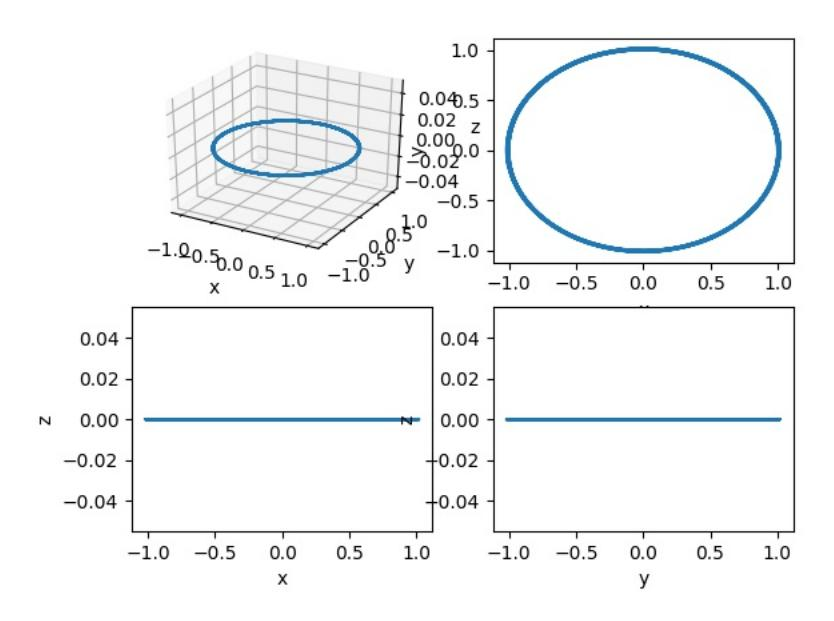

Figure 5: Runge-Kutta Method Approximation to Circular Orbit

Runge-Kutta method is able to contain error rate much better, which leads to a more reliable simulation result at the expense of a linear increase in computation cost. Further more, Runge-Kutta method is easily parallelized as was done in one of the implementations. Such parallelization is only necessary when an exceedingly large number of particles are simulated.

### 5.3 Velocity Correction

To further reduce the error produced during the numerical approximations, a technique that exploits the energy conservation properties of particles in a static potential field was developed. Although it was inapplicable to the final simulation with a rotating background potential (because total mechanical energy of the particle system is not conserved), this technique was still useful in earlier stages of the simulation.

$$v_{corrected} = \sqrt{\frac{TE - PE_{current}}{KE_{current}}} v_{current}$$
(40)

Explicitly, a velocity correction function is applied to the particles after each time step during the simulation. The velocity vector of a particle is scaled up or down according to the amount of kinetic energy it should have. This reference kinetic energy was calculated from the recorded total energy of the particle and its potential energy at the current location. The recorded total energy of a particle will only change when it undergoes collision.

# 6 Collision

The core part of this simulation lies upon the conjecture that collisions can help the system achieve a dynamic equilibrium state. Since the rotational potential we used is transferring energy to the system, inelastic collisions could possibly stabilize the system and prevent particles to escape and destroy the pattern. To fully demonstrate how this collision mechanism is implemented, the concepts of coefficient of restitution (COR) and the line of impact must be introduced.

### 6.1 Coefficient of Restitution and Line of Impact

coefficient of restitution (COR), or e, represents the ratio of final velocity to initial velocity. In this simulation, there's no energy gain for the gas particles during collision, so this variable will always stay in the range of 0 to 1. It can be calculated by

$$e = \sqrt{\frac{KE_{after}}{KE_{before}}} = \frac{Relative\ Speed\ After}{Relative\ Speed\ Before}$$

Noted that this formula only applies to one dimensional cases. In order for our three dimensional model to work, we have to consider the line of impact, which is the line that e is defined. In our simulation, we model the gas clouds in the galaxies to be hard and rigid spheres. The line of impact would simply be the line across the centers of two colliding particles. To further calculate the final velocities of the colliding particles, we need to decompose their velocities into velocity components that are tangent to the line of impact and ones that are normal to the line of impact. Along this line , the collision can be calculated like in one dimensional case using this formula:

$$V_{a(After)} = \frac{m_a V_a + m_b V_b + e \times m_b (V_b - V_a)}{m_a + m_b}$$

and respectively,

$$V_{b(After)} = \frac{m_a V_a + m_b V_b + e \times m_a (V_a - V_b)}{m_a + m_b}$$

Noted that Va and Vb here are velocity components which have been already decomposed along the the line of impact. The velocity components that are perpendicular to the line of impact would remain unchanged. The combination of these components would give us the final result.

### 6.2 Implementation

To fully detect all the collisions, a point to point scanning system is unavoidable. However, we do implement a method to make the collision part more efficient. Since we store all the particles in an array, we can sort them based on their x coordinates. For each particle, the detection system would check the particles that are adjacent to this particle. Once this system has checked a particle that has an x coordinate which has a difference bigger than 2 times the radius with the current particle, this would signal any particle beyond this range would have no chance of colliding with the current particle. This loop would automatically end and the system would proceed to the next particle. In addition, each particle has a unique index number and they also store a number which represents the index number of the last particle they collide with. This mechanism can effectively prevent unnecessary collision. Since when the collision system updating the particles, only their velocities are changed, and their positions would remain unchanged until the next RK4 loop. This mechanism would make the system stop misreading the colliding particles to be colliding again when they have actually just collided with each other.

# 7 Collapse of Spherical Galaxies to Disc Galaxies

### 7.1 A Brief Introduction to the Process of Collapsing

#### 7.2 Quantifying "Disc-ness" of a Galaxy

The "Disc-ness" of a galaxy depends pretty much on the orbits of particles inside the system. The more planar the orbits are, the more "disc-like" the galaxy would be. Since if the orbit of a particle is on the xy plane, its motion would contribute primarily to an angular momentum along z-direction. Since during the process of collapsing, total mechanical energy of the system decreases while  $L_z$  remains the same, which is exactly why a spheroidal system tends to become planar, intuitively, the total energy and total z-direction angular momentum of the system can be indicators of how "disc-like" the system is. In our simulations, we propose a new measurement,  $\frac{L_z}{L_{z,max}}$  to quantify the "disk-ness" of the galaxy where  $L_{z,max}$  is the maximum z-direction angular momentum a system can get given a fixed total energy.

In order to show how this new measurement is relevant to the shape of galactic systems, we first consider only the spherically symmetric potentials. Without loss of generality, we let the potential energy to be positive everywhere. Since if a potential is non-positive, we can always add a positive number to the potential such that the potential is positive everywhere except for a small region close to the origin. If we consider the origin to be a sphere wherein no other matter can enter, it is always possible to make the gravitational potential positive everywhere.

Assume  $V(r) \ge 0$  everywhere, and assume m to be 1. Total energy of the system  $E = V(x(t)) + \frac{1}{2}|x'(t)|^2$  and the total z-direction angular momentum  $L_z = (x(t) \times x'(t)) \cdot \vec{k}$ . Then we can have an inequality,

$$\begin{split} \lambda &= \frac{L_z}{E} = \frac{(x(t) \times x'(t)) \cdot \vec{k}}{E} \\ &\leqslant \frac{|x| \cdot |x'| \cdot 1}{E} = r \sqrt{2(E - V(r))} = \sqrt{2(\frac{r^2}{E} - \frac{r^4}{E^2} \cdot \frac{V(r)}{r^2})} \\ &\leqslant \max_s \sqrt{2(s - s^2 \cdot \frac{V(r)}{r^2})} \end{split}$$

where  $s=\frac{r^2}{E}.$  Maximum occurs at  $\frac{r^2}{2V(r)}$  using the quadratic formula. As a result,

$$\lambda = \frac{L_z}{E} \leqslant \sqrt{\frac{r^2}{2V(r)}} \leqslant \max_{s} \sqrt{\frac{r^2}{2V(r)}} = \frac{1}{\min_{r} \sqrt{\frac{2V(r)}{r^2}}}$$

As a result, if the total mechanical energy of the system is fixed, there is a maximum amount of z-direction angular momentum the system can get  $(\frac{1}{\min_r \sqrt{\frac{2V(r)}{r^2}}} \cdot E)$ . Since this value is the maximum z-direction

angular momentum a system with mechanical energy E can get, we call it  $L_{z,max}$ . Because  $\frac{1}{\min_{r} \sqrt{\frac{2V(r)}{r^2}}}$  is a constant for each specific potential,  $L_{z,max} \propto E$ . Since in the simulations we conducted, we actually adopted negative gravitational potentials, it is better to use  $\frac{L_z}{L_{z,max}}$  as an measurement for "disc-ness".

Lemma 1: If a particle i has maximum  $\lambda_i$  value, then its orbit is a circle with radius  $r_{i,max}$  on the xy plane.

Proof:

For a specific particle i,  $\lambda_i \leqslant \max_r \sqrt{2[\frac{r^2}{E} - \frac{r^4}{E^2} \cdot \frac{V(r)}{r^2}]}$ . If  $L_z = L_{z,max} = \max_r \sqrt{2r^2(E - V(r))}$ , we must have equality everywhere, so  $x'(t) \perp x(t)$ ,  $x'(t) \times x(t)$  along z-axis and  $ra = v^2$ . Now, consider the Frenet frame for this orbit, since V(r) is spherically symmetric, the net force on a particle,  $-\nabla V(r)$  is pointing to the origin. Thus, x''(t) has the same direction of x(t). Since the particle is moving in x'(t), the T for the Frenet frame would be x'(t). Since x(t) has the same direction as x''(t), which has the same direction as x''(t) in the Frenet frame, so X would be X(t). Thus, since the cross product of X(t) and X(t) is always of X(t) is always of X(t) is always along X(t) is always along X(t) is always along X(t) is always along X(t) is always along X(t) is always along X(t) is always along X(t).

for the orbit would always be along z-axis and thus the orbit would always be parallel with the xy plane. Since x(t) is also in the plane defined by B vector, the origin has to be on the plane as well. Therefore, if  $\lambda_i$  reaches  $\lambda_{i,max}$ , its orbit is on the xy plane. Since  $x'(t) \perp x(t)$ , which means  $x'(t) \perp x''(t)$ , its orbit is also a circle with radius  $r_{i,max}$ .

When  $L_z = L_{z,max}$ , for each particle,  $L_{i,z} = L_{i,max,z}$ . Thus, the whole system would be in a perfect "disc-shape". While  $\frac{L_z}{Lz,max} = 0$ , all the particles would be moving randomly and the whole system would be more spherical. By using  $\frac{L_z}{L_{z,max}}$  as an indicator of the shape of the system. we would be able to quantify how "disc-like" our system is.

# 8 Preliminary Simulation Results with Static Potential

distance from origin.

The process by which the initialized particle cloud collapse into a disc is simulated prior to adding the wave dark matter. Several potential functions were tested and they yield similar results. Below is the result of the particle cloud collapsing into a disc in a classical potential  $p = -\frac{1}{r}$  where r is the

100 20 50 10 0 -10 -2001020 -10020 -50 Ó 50 100 100 100 50 50 0 0 -50-50 -100-100 -100-50 0 50 100 -100-500 50 100

Figure 6: Beginning of simulation: cloud

у

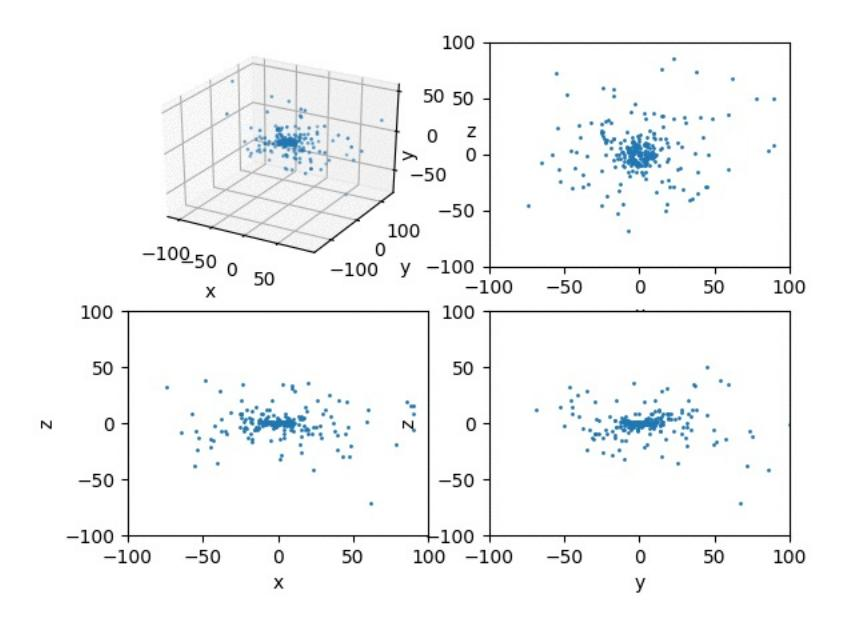

Figure 7: Dtabilized: disc

Several parameters of the whole particle system were monitored and they exhibit reasonable behavior as the simulation proceeds.

First, the total energy of the system is decreasing:

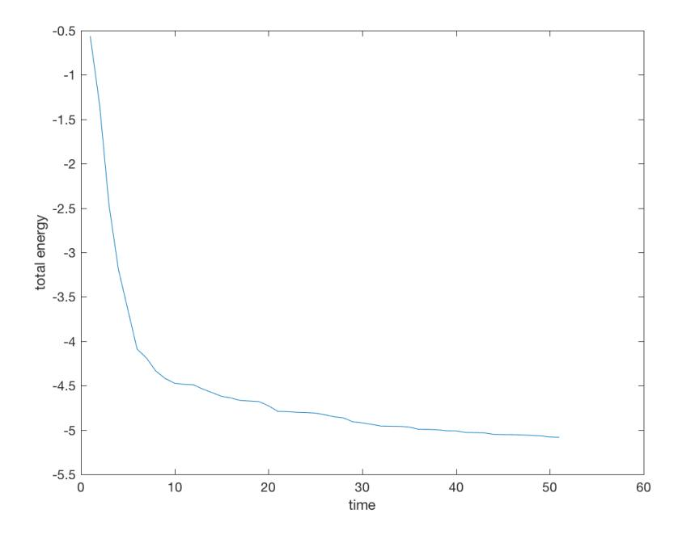

Figure 8: Decreasing total energy

Second, the rate at which the total mechanical energy of the system changes is decreasing as well:

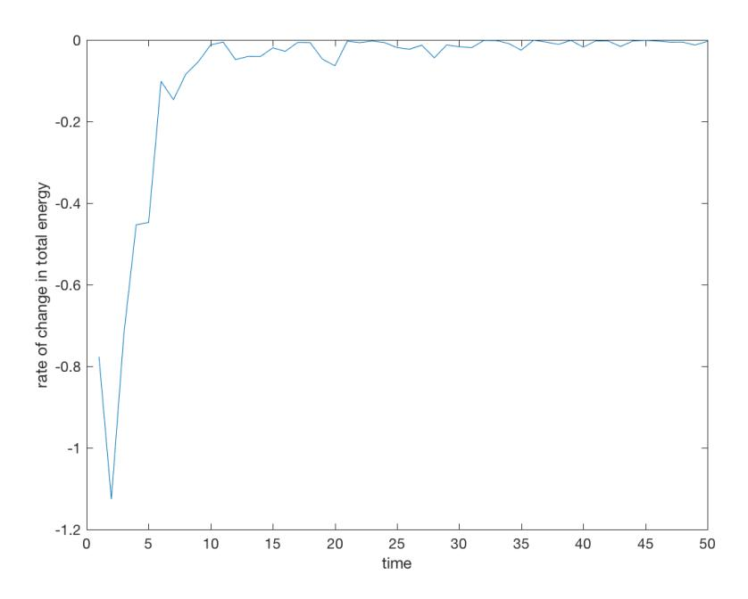

Figure 9: Decreasing rate

Third, the particle system was becoming more disc-shaped as the above-mentioned "disc-ness" measure reveals:

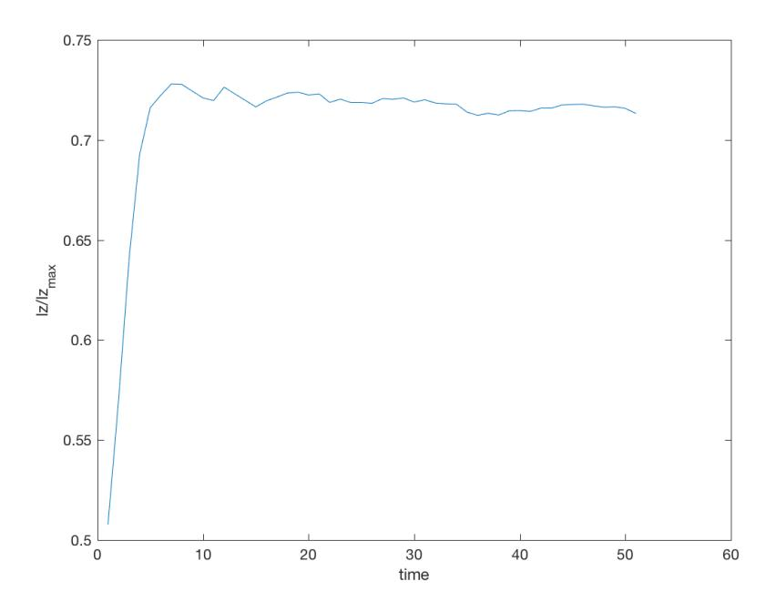

Figure 10: lz/lzmax

Removing the collisions prevents the particle cloud from collapsing into a disc.

#### 9 The Potential of Dark Matter

#### 9.1 Solving the Einstein-Klein-Gordon Equation

In order to get the gravitational potential produced by dark matter, we need to first solve for the density function of dark matter using the Einstein-Klein-Gordon. In Bray's 2010 paper [2], spherical harmonics were used to get the general solution. The general solution for the wave function is of the form,

$$f = A\cos(\omega t) \cdot Y_n(\theta, \phi) \cdot r^n \cdot f_{\omega,n}(r) \tag{41}$$

where

$$f''_{\omega,n}(r) + \frac{2(n+1)}{r} f'_{\omega,n}(r) = (\Upsilon^2 - \omega^2) f_{\omega,n}$$
(42)

and  $Y_n(\theta, \phi)$  is an  $n^{th}$  degree spherical harmonics. We are only using the real spherical harmonics since only the real wave functions can guarantee the density function to be positive. In a more detailed case where relativity effect is concerned,

$$V(r)^{2} (f_{\omega,n}''(r) + \frac{2(n+1)}{r} f_{\omega,n}'(r)) = (\Upsilon^{2} - \frac{\omega^{2}}{V(r)^{2}}) f_{\omega,n}$$
(43)

but in our simulations, since we are only interested in the scale of galaxies, we are just using the Newtonian equations.

After the wave function f is solved, the density function for dark matter,  $\mu_{DM}$  can be solved by the following equation,

$$\frac{\mu_{DM}}{\mu_0} = \frac{1}{8\pi\mu_0} G(\partial_t, \partial_t) \tag{44}$$

note that the right hand side can be approximated by  $\frac{1}{\Upsilon^2}(f_t^2 + |\nabla_x f|^2) + f^2 = (\frac{f_t}{\Upsilon})^2 + f^2$ , and thus,

$$\frac{\mu_{DM}}{\mu_0} \approx \left(\frac{f_t}{\Upsilon}\right)^2 + f^2 \tag{45}$$

The gravitational potential for dark matter can then be solved by,

$$\frac{V}{4\pi\mu_0} = \Sigma W_n(r) Y_{n,m} \tag{46}$$

where

$$W_n''(r) + \frac{2(n+1)}{r}W_n'(r) = U_n(r)$$
(47)

where the U functions are combinations of spherical harmonic cross terms yield when the wave function is squared to get the density function. Then, the gradient of this potential is taken to use as a force field to run the simulations.

#### 9.2 Adding more Spherical Harmonic Terms

General solutions to the wave function of wave dark matter can be written in the following form:

$$f = \sum A \cos(\omega t) \cdot Y_n(\theta, \phi) \cdot r^n \cdot f_{\omega, n}(r) \tag{48}$$

If we consider a general form for the wave function to up to  $3^r d$  degree, and assume angular velocity  $\omega_l$  and initial phase  $\arctan(\frac{1}{k_l})$  to be the same for all ms for a given l, it would be,

 $f = A_{0,0}(\cos(\omega_0 t) + k_0 \sin(\omega_0 t)) f_{\omega_0,0}(r) + A_{1,\pm 1}(\cos(\omega_1 t) + k_1 \sin(\omega_1 t)) r \sin(\phi + \delta_{1,\pm 1}) \sin(\theta) f_{\omega_1,1}(r) + A_{1,0}(\cos(\omega_1 t) + k_1 \sin(\omega_1 t)) r \cos(\theta) f_{\omega_1,1}(r) + A_{2,\pm 2}(\cos(\omega_2 t) + k_2 \sin(\omega_2 t)) r^2 \sin(2\phi + \delta_{2,\pm 2}) \sin^2(\theta) f_{\omega_2,2}(r) + A_{2,\pm 1}(\cos(\omega_2 t) + k_2 \sin(\omega_2 t)) r^2 \sin(2\phi + \delta_{2,\pm 2}) \sin^2(\theta) f_{\omega_2,2}(r) + A_{2,\pm 1}(\cos(\omega_2 t) + k_2 \sin(\omega_2 t)) r^2 (3\cos^2(\theta) - 1) f_{\omega_2,2}(r) + A_{3,\pm 3}(\cos(\omega_3 t) + k_3 \sin(\omega_3 t)) r^3 \sin(3\phi + \delta_{3,\pm 3}) \sin^3(\theta) f_{\omega_3,3}(r) + A_{3,\pm 2}(\cos(\omega_3 t) + k_3 \sin(\omega_3 t)) r^3 \sin(2\phi + \delta_{3,\pm 2}) \cdot \sin^2(\theta) \cos(\theta) f_{\omega_3,3}(r) + A_{3,\pm 1}(\cos(\omega_3 t) + k_3 \sin(\omega_3 t)) r^3 \sin(\phi + \delta_{3,\pm 3}) \sin(\theta) (5\cos^2(\theta - 1)) f_{\omega_3,3}(r) + A_{3,0}(\cos(\omega_3 t) + k_3 \sin(\omega_3 t)) r^3 \sin(\phi + \delta_{3,\pm 3}) \sin(\theta) (5\cos^2(\theta - 1)) f_{\omega_3,3}(r) + A_{3,0}(\cos(\omega_3 t) + k_3 \sin(\omega_3 t)) r^3 \sin(\phi + \delta_{3,\pm 3}) \sin(\phi + \delta_{3,\pm 3}) \sin(\phi) (5\cos^2(\theta - 1)) f_{\omega_3,3}(r) + A_{3,0}(\cos(\omega_3 t) + k_3 \sin(\omega_3 t)) r^3 \sin(\phi + \delta_{3,\pm 3}) \sin(\phi + \delta_{3,\pm 3}) \sin(\phi + \delta_{3,\pm 3}) \sin(\phi + \delta_{3,\pm 3}) \sin(\phi + \delta_{3,\pm 3}) \sin(\phi + \delta_{3,\pm 3}) \sin(\phi + \delta_{3,\pm 3}) \sin(\phi + \delta_{3,\pm 3}) \sin(\phi + \delta_{3,\pm 3}) \sin(\phi + \delta_{3,\pm 3}) \sin(\phi + \delta_{3,\pm 3}) \sin(\phi + \delta_{3,\pm 3}) \sin(\phi + \delta_{3,\pm 3}) \sin(\phi + \delta_{3,\pm 3}) \sin(\phi + \delta_{3,\pm 3}) \sin(\phi + \delta_{3,\pm 3}) \sin(\phi + \delta_{3,\pm 3}) \sin(\phi + \delta_{3,\pm 3}) \sin(\phi + \delta_{3,\pm 3}) \sin(\phi + \delta_{3,\pm 3}) \sin(\phi + \delta_{3,\pm 3}) \sin(\phi + \delta_{3,\pm 3}) \sin(\phi + \delta_{3,\pm 3}) \sin(\phi + \delta_{3,\pm 3}) \sin(\phi + \delta_{3,\pm 3}) \sin(\phi + \delta_{3,\pm 3}) \sin(\phi + \delta_{3,\pm 3}) \sin(\phi + \delta_{3,\pm 3}) \sin(\phi + \delta_{3,\pm 3}) \sin(\phi + \delta_{3,\pm 3}) \sin(\phi + \delta_{3,\pm 3}) \sin(\phi + \delta_{3,\pm 3}) \sin(\phi + \delta_{3,\pm 3}) \sin(\phi + \delta_{3,\pm 3}) \sin(\phi + \delta_{3,\pm 3}) \sin(\phi + \delta_{3,\pm 3}) \sin(\phi + \delta_{3,\pm 3}) \sin(\phi + \delta_{3,\pm 3}) \sin(\phi + \delta_{3,\pm 3}) \sin(\phi + \delta_{3,\pm 3}) \sin(\phi + \delta_{3,\pm 3}) \sin(\phi + \delta_{3,\pm 3}) \sin(\phi + \delta_{3,\pm 3}) \sin(\phi + \delta_{3,\pm 3}) \sin(\phi + \delta_{3,\pm 3}) \sin(\phi + \delta_{3,\pm 3}) \sin(\phi + \delta_{3,\pm 3}) \sin(\phi + \delta_{3,\pm 3}) \sin(\phi + \delta_{3,\pm 3}) \sin(\phi + \delta_{3,\pm 3}) \sin(\phi + \delta_{3,\pm 3}) \sin(\phi + \delta_{3,\pm 3}) \sin(\phi + \delta_{3,\pm 3}) \sin(\phi + \delta_{3,\pm 3}) \sin(\phi + \delta_{3,\pm 3}) \sin(\phi + \delta_{3,\pm 3}) \sin(\phi + \delta_{3,\pm 3}) \sin(\phi + \delta_{3,\pm 3}) \sin(\phi + \delta_{3,\pm 3}) \sin(\phi + \delta_{3,\pm 3}) \sin(\phi + \delta_{3,\pm 3}) \sin(\phi + \delta_{3,\pm 3}) \sin(\phi + \delta_{3,\pm 3}) \sin(\phi + \delta_{3,\pm 3}) \sin(\phi + \delta_{3,\pm 3}) \sin(\phi + \delta_{3,\pm 3}) \sin(\phi + \delta_{3,\pm 3}) \sin(\phi + \delta_{3,\pm$ 

$$k_3 \sin(\omega_3 t)) r^3 (5 \cos^3(\theta - 3\cos(\theta))) f_{\omega_{3,3}}(r)$$

The first order spherical harmonics will cause the center of mass of dark matter to oscillate. If we do not allow this to happen, and only consider harmonics of degree two or below, the general form of the wave function would be given as:

$$f = A_{0,0}\cos(\omega_0 t)f_{\omega_0,0}(r) + A_{1,\pm 1}(\cos(\omega_1 t) + A_{2,\pm 2}(\cos(\omega_2 t) + k_2\sin(\omega_2 t))r^2\sin(2\phi + \delta_{2,\pm 2})\sin^2(\theta)f_{\omega_2,2}(r) + A_{2,\pm 1}(\cos(\omega_2 t) + k_2\sin(\omega_2 t))r^2\sin(2\phi + \delta_{2,\pm 2})\sin(\theta)\cos(\theta)f_{\omega_2,2}(r) + A_{2,0}(\cos(\omega_2 t) + k_2\sin(\omega_2 t))r^2(3\cos^2(\theta) - 1)f_{\omega_2,2}(r)$$

In order to simplify this formula, we define  $C_{l,m}$  to be the part caused by the spherical harmonic  $Y_{l,m}$ , and  $C_{l,\pm m}$  to be the combined contribution

Now, we can compare the generic second order spherical harmonics expansion solution to the Einstein-Klein-Gordon Equation with the solution Bray gave in his 2010 paper. In his paper, he only included two second order spherical harmonics terms, specifically,  $Y_{2,2}$  and  $Y_{2,-2}$ . The wave function given by Bray is of the form:

$$f = A_0 \cos(\omega_0 t) f_{\omega_0,0}(r) + A_2 \cos(\omega_2 t - 2\phi) \sin^2(\theta) r^2 f_{\omega_2,2}(r)$$
(49)

Since only  $Y_{0,0}$ ,  $Y_{2,2}$  and  $Y_{2,-2}$  are chosen to be included in the solution, we can see that  $A_{2,\pm 1}$  and  $A_2,0$  are both set to be zero, and  $\delta_{2,\pm 2}$  is set such that a specific combination of  $Y_{2,2}$  and  $Y_{2,-2}$  is given.

If we expend the solution given by Bray:

$$f = A_0 \cos(\omega_0 t) f_{\omega_0,0}(r) + A_2 \cos(\omega_2 t) \cos(2\phi) \sin^2(\theta) r^2 f_{\omega_2,2}(r) + A_2 \sin(\omega_2 t) \sin(2\phi) \sin^2(\theta) r^2 f_{\omega_2,2}(r)$$
 (50)

In this formula, we can clearly see that the first term is from  $Y_{0,0}$ , the second from  $Y_{2,2}$ , and the third from  $Y_{2,-2}$ , which corresponding to our wave function if we allow the initial phase for  $Y_{2,+2}$  to be different from  $Y_{2,-2}$ 

In this paper, we were still using Bray's potential to do the simulations, but it is definitely necessary in the future to try potentials with more spherical harmonics added in.

# 10 Formation of Spiral Patterns

It is unrealistic to include all the spherical harmonic terms in the simulation. As such, only a selected few even order spherical harmonic terms were included in the actual simulation. The odd terms were not included because they lead to an oscillating center of mass for the dark matter. We were able to recreate the spiral galaxy patterns in the 2010 paper on Wave Dark Matter as well as generating new patterns by tweaking the parameters.

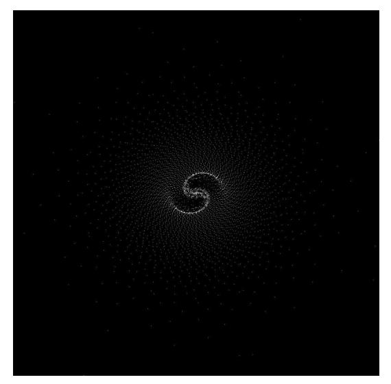

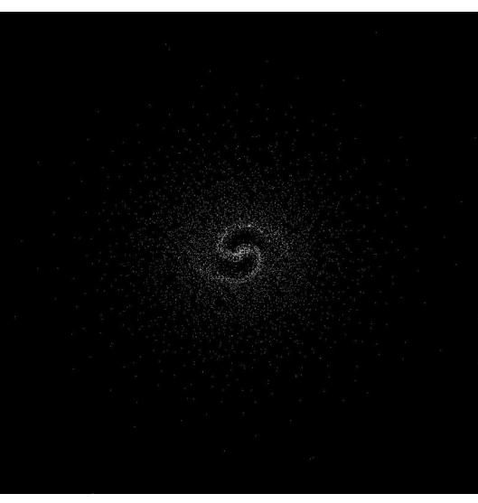

Particles starting in XY plane with circular orbit Particles starting in XY plane with moderately elliptical orbit

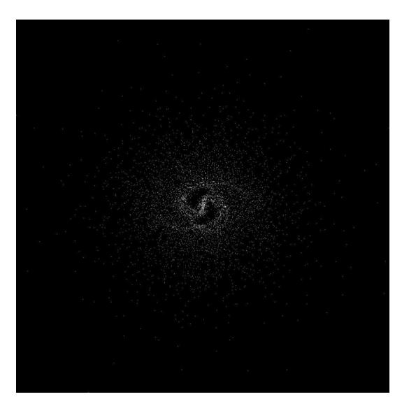

Particles starting in XY plane with more elliptical orbit Particles starting in XY plane with even more elliptical orbit

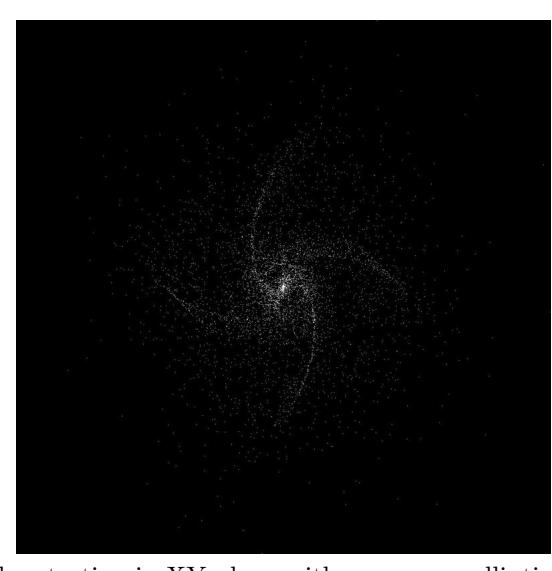

Furthermore, when the starting condition includes a randomization in the z coordinates of particles, similar patterns is formed.

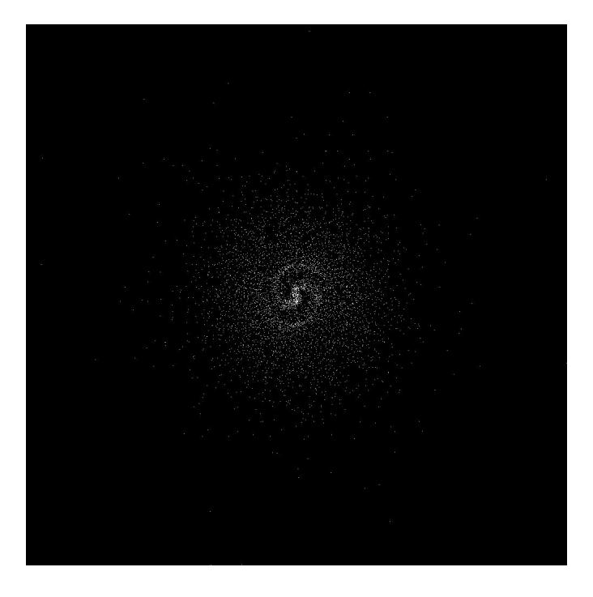

Figure 11: Spiral pattern formed when starting with gas cloud

The gas cloud was also observed to collapse into a disc:

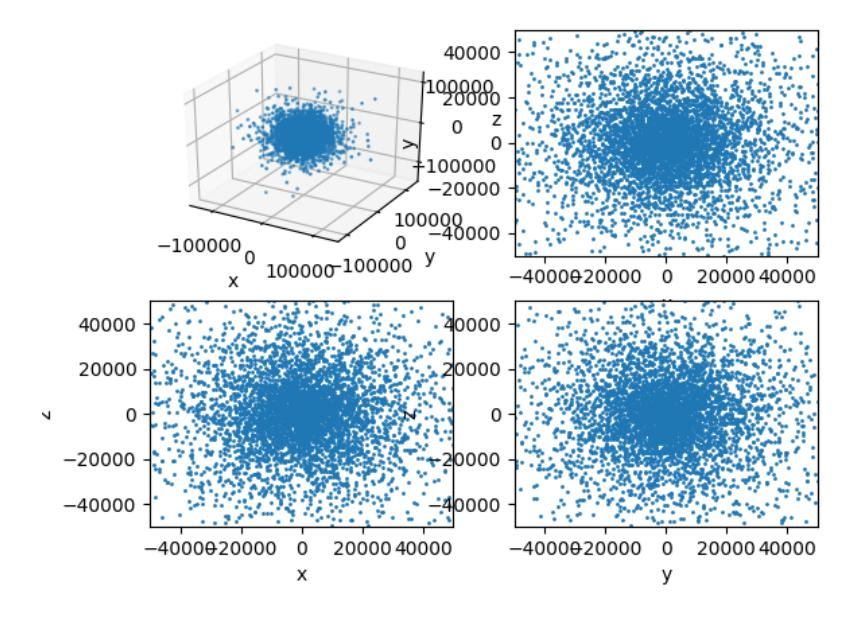

Figure 12: Cloud at the start

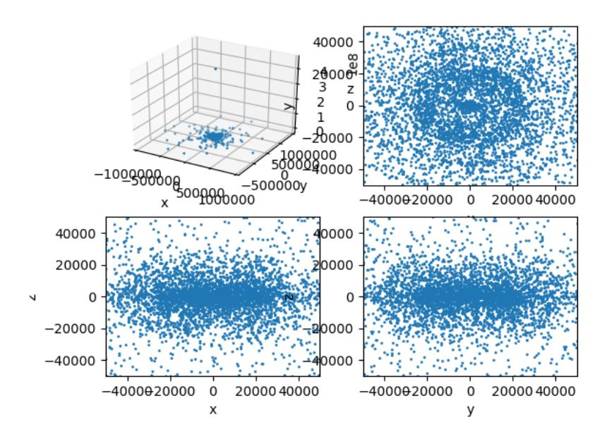

Figure 13: Disc formed

Such a collapse, however, is mainly due to the dark matter itself rather than the collisions for that very few collisions were actually observed during the process.

# 11 References

- [1] B. O'Neil, "Semi-Riemannian Geometry with Applications to Relativity." Academic Press, 1983.
- [2] Bray, Hubert. "On Dark Matter, Spiral Galaxies, and the Axioms of General Relativity." Geometric Analysis, Mathematical Relativity, and Nonlinear Partial Differential Equations Contemporary Mathematics (2010)
- [3] "CERN Accelerating science." Dark matter CERN. N.p., n.d. Web. 15 June 2017.
- [4] NASA. NASA, n.d. Web. 15 June 2017.
- [5] Battaglia, G., A. Helmi, H. Morrison, P. Harding, E. W. Olszewski, M. Mateo, K. C. Freeman, J. Norris, and S. A. Shectman. "The radial velocity dispersion profile of the Galactic halo: constraining the density profile of the dark halo of the Milky Way." Monthly Notices of the Royal Astronomical Society 370.2 (2006): 1055-056.
- [6] Navarro, Julio F. "The structure of cold dark matter halos." Symposium-international astronomical union. Vol. 171. Cambridge University Press, 1996.
- [7] Jing, Y. P., and Yasushi Suto. "The density profiles of the dark matter halo are not universal." The Astrophysical Journal Letters 529.2 (2000): L69.
- [8] Hubble, Edwin Powell, Robert P. Kirshner, and Sean Michael Carroll. The realm of the nebulae. New Haven: Yale U Press, 2013. Print.
- [9] Roberts, W. W. "Large-scale shock formation in spiral galaxies and its implications on star formation." The Astrophysical Journal 158 (1969): 123.
- [10] Som, T., and R. Chakravarty. "Calculation of Gravitational Potential of an Ellipsoidal Mass of Prolate Shape at Any Point outside the Prolate." American Journal of Mathematics and Statistics 2.3 (2012): 27-32. Web.